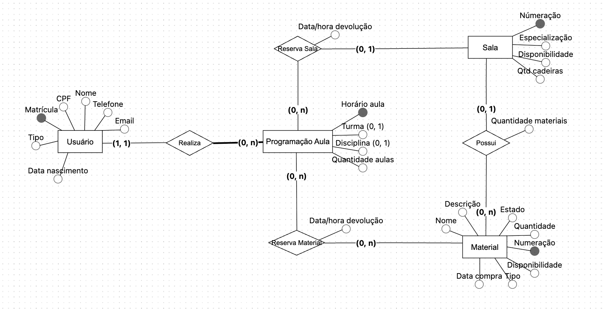
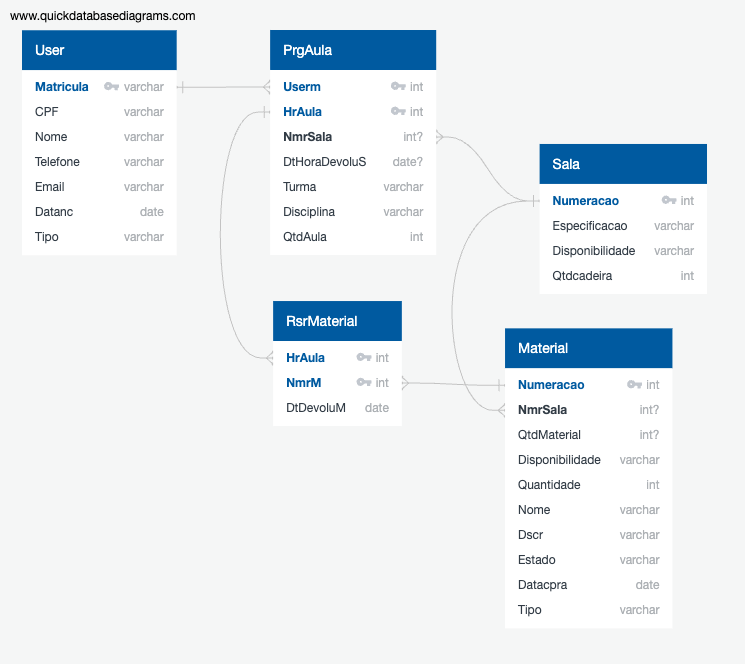

# Projeto

Neste projeto foi desenvolvido um sistema de gerenciamento de salas e materiais escolares. A aplicação foi construída com React e Tailwind no frontend e Node.js com Express no backend, utilizando JWT para autenticação e pg-promise para conexão com o banco de dados PostgreSQL.

O projeto tem como intuito integrar conhecimentos das disciplinas de Programação II, Engenharia de Software e Banco de Dados.

**Alunos**:     
Luisa Feil Kroth - 20230001300  
Vinícius Guerra - 20230003790

## Teoria
**Modelo conceitual do banco de dados**


**Modelo lógico relacional do banco de dados**


## 📦 Frontend - Nome da Aplicação

Interface web desenvolvida com **React** para o sistema de gerenciamento de salas e materiais escolares. Este frontend se comunica com o backend via API REST.

---

## 🚀 Tecnologias Utilizadas

- [React](https://reactjs.org/)
- [React Router](https://reactrouter.com/)
- [Axios](https://axios-http.com/)
- [Vite](https://vitejs.dev/)
- [Tailwind CSS](https://tailwindcss.com/) 
---

## 📁 Estrutura de Pastas (exemplo)
```none
frontend
├── public/
├── src/
│   ├── assets/
│   ├── components/
│   ├── pages/
│   ├── utils/
│   ├── App.jsx
│   ├── index.jsx
│   └── main.jsx
├── package.json
├── tailwind.config.js
└── .env
```

## Como rodar o projeto localmente com Vite

1. **Pré-requisitos**:  
   - Node.js (recomenda-se a versão LTS)  
   - npm ou yarn

2. **Instalar as dependências**:  
    No terminal, dentro da pasta do projeto, execute:

    ```bash
    npm install
    ou
    yarn

3. **Rodar o projeto localmente**:
    ```bash
    npm run dev
    ou
    yarn dev    

# 🖥️ Backend - Nome da Aplicação

API REST desenvolvida em **Node.js** com **Express**, responsável por gerenciar a criação de usuários, criação de salas, criação de materiais, reservas de salas, reservas de materiais, autenticação de usuários, etc.

---
## 🚀 Tecnologias Utilizadas

- [Node.js](https://nodejs.org/)
- [Express](https://expressjs.com/)
- [PostgreSQL](https://www.postgresql.org/)
- [Express](https://expressjs.com/)
- [JWT](https://jwt.io/)

---

## 📁 Estrutura de Pastas

```none
backend/
├── src/
│   ├── config/
│   ├── middleware/
│   ├── repository/
│   ├── routes/
│   └── service.js
├── docker-compose.yml
├── .env
├── package.json
└── README.md
```

## Como rodar o projeto localmente com Vite

1. **Pré-requisitos**:  
   - Node.js (recomenda-se a versão LTS)  
   - npm ou yarn
   - docker-compose

2. **Instalar as dependências**:  
    No terminal, dentro da pasta do projeto, execute:

    ```bash
    npm install
    ou
    yarn

3. **Rodar o projeto localmente**:
    ```bash
    docker-compose-up
    node service.js   

## 📡 Rotas da API
Exemplo de algumas rotas da API (documentação completa via Swagger/Postman se aplicável):

Método	Rota	Descrição

| Método | Rota                      | Acesso                | Descrição                                |
|--------|---------------------------|------------------------|--------------------------------------------|
| POST   | `/auth`                       | Público               | Realiza login e gera token JWT             |
| GET    | `/users`                  | `admin`               | Lista todos os usuários                    |
| POST   | `/users`                  | `admin`               | Cria um novo usuário                       |
| PATCH  | `/users/:matricula`       | `admin`               | Atualiza os dados de um usuário            |
| DELETE | `/users/:matricula`       | `admin`               | Remove (desativa) um usuário               |
| GET    | `/users/profile/:matricula` | `admin`             | Busca um usuário pela matrícula            |
| GET    | `/users/profile`          | usuário autenticado   | Retorna o perfil do próprio usuário logado |
| GET    | `/materials`          | admin   | Lista todos os materiais                    |
| POST   | `/materials`          | admin   | Cria um novo material                       |
| GET    | `/materials/:materialId` | admin | Busca material pelo número de identificação |
| PATCH  | `/materials/:materialId` | admin | Atualiza os dados de um material            |
| GET    | `/rooms`                      | `admin`, `docente`      | Lista todas as salas                           |
| POST   | `/rooms`                      | `admin`                 | Cria uma nova sala                             |
| GET    | `/rooms/:numeracao`           | `admin`                 | Busca uma sala pelo número                     |
| PATCH  | `/rooms/:numeracao`           | `admin`                 | Atualiza os dados de uma sala                  |
| DELETE | `/rooms/:numeracao`           | `admin`                 | Remove (desativa) uma sala                     |
| PATCH  | `/rooms/:numeracao/status`    | `admin`                 | Alterna o status de disponibilidade da sala    |
| GET    | `/reservation/classroom`                           | admin  | Lista todas as reservas de salas                                   |
| POST   | `/reservation/classroom`                           | admin  | Cria uma nova reserva de sala                                      |
| GET    | `/reservation/classroom/:matricula`                | admin  | Busca uma reserva de sala pela matrícula do usuário                 |
| PATCH  | `/reservation/classroom/:matricula`                | admin  | Atualiza uma reserva de sala existente                             |
| DELETE | `/reservation/classroom/:numeracao`                | admin  | Remove (cancela/desativa) uma reserva de sala                      |
| GET    | `/reservation/classroom/:matricula/:hora`          | admin  | Retorna quantidade de aulas em uma reserva com base na matrícula e hora |
| GET    | `/reservation/material`                            | admin  | Lista todas as reservas de materiais                                  |
| POST   | `/reservation/material`                            | admin  | Cria uma nova reserva de material                                     |
| GET    | `/reservation/material/:matricula`                 | admin  | Busca uma reserva de material pela matrícula do usuário               |
| PATCH  | `/reservation/material/:matricula`                 | admin  | Atualiza uma reserva de material                                      |
| DELETE | `/reservation/material/:numeracao`                 | admin  | Remove (cancela/desativa) uma reserva de material                     |
| GET    | `/reservation`            | admin  | Retorna reservas de sala e material com filtro|